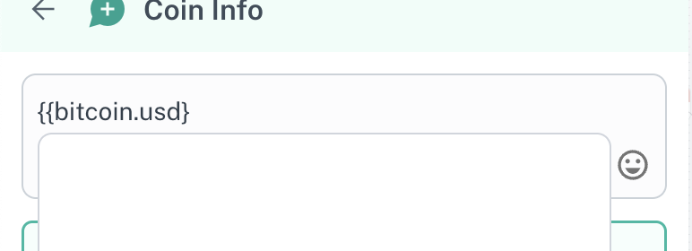
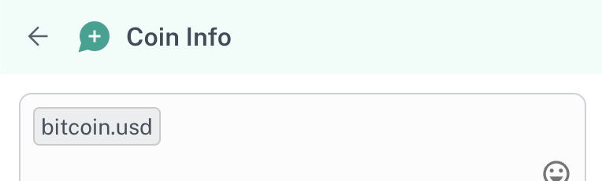

# FAQ

1. **What if the variable I use is empty? For example — if I use the name variable, and the contact doesn’t have a name set?**
    
    In such a case, we replace the variable with the default value — typically blank text. Here is the default value for different channels:
    
    - WhatsApp Business API (WABA): “N/A”
        - Eg. “Hello {{name}}!” will become “Hello N/A”
    - All Other Channels: “” (blank text)
        - Eg. “Hello {{name}}!” will become “Hello ”
2. **The variable list is too long, can I search for variables?**
    
    Yes you can! Just start typing the name of the variable you’re looking for and once you find it — either click it or use the keyboard to select it 
    
    
    
3. **Can I use variables directly from the inbox?**
    
    Yes, you can! Just press the `{` anywhere in your message to see what variables are available to you
    
    
    
    Select the one you need, and continue typing your message!
    
4. **When using the webhook, or HTTP request — we don’t see the variables outputted from there in the dropdown list. How can I add a custom variable absent from the list?**
    
    No worries, you can add a custom variable absent from the list by typing the variable you need in double curly braces. Once you add the final curly brace — the variable will get detected as one and get formatted.
    
    
    
    
    
    To learn more about the advanced usage of variables, read our “Advanced Usage” doc.
    
5. **When I send a date/timestamp variable — what timezone will it use?**
    
    We use your team’s timezone to format the timestamp.
    
6. **Can I customise the format of the date when sending a timestamp variable?**
    
    No, this is not possible at the moment. The format being used right now is:
    
    `M/D/YYYY, H:mm:SS A` . For eg. `7/3/2024, 1:21:54 PM`